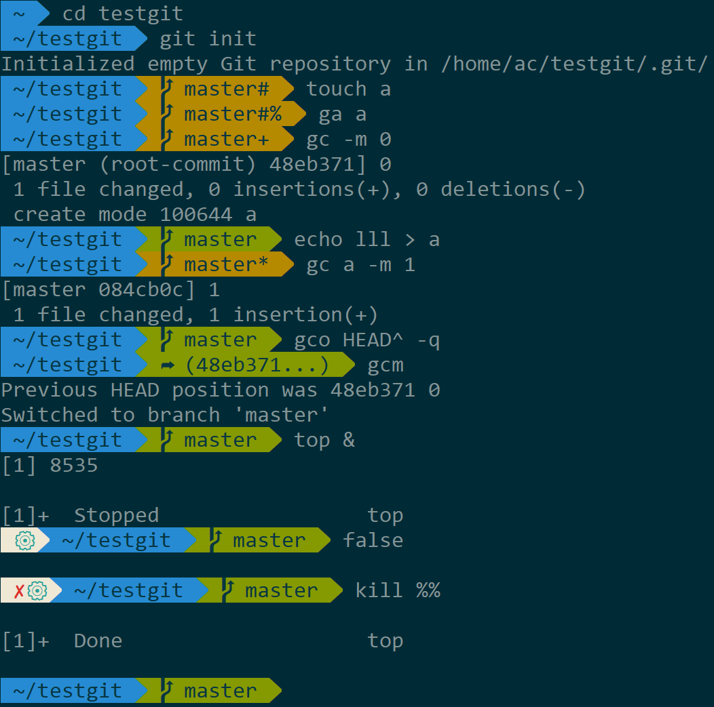
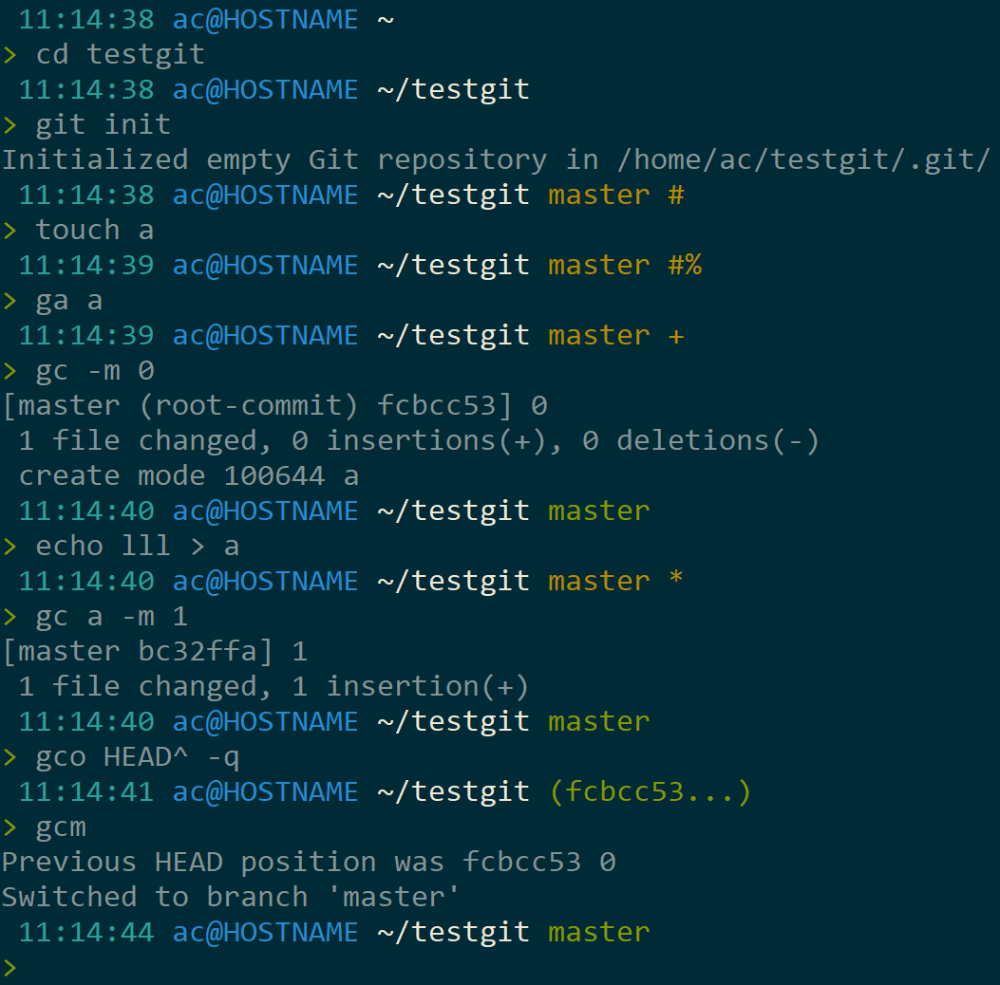

# z-bash
light-weight bash script for ps1 and alias, inspired by zsh

## Features

- zsh alias (considered git completion)
- cd stack
- config up and down arrow key for history look up
- both agnoster and plain prompt available

## Screenshots

### agnoster



### plain



## Install

```bash
git clone https://github.com/AllanChain/z-bash ~/.z-bash
```
And put following lines in your `.bashrc`
```bash
Z_BASH_STYLE=agnoster # Optional, omitting this line means using plain prompt
. ~/.z-bash/z-bash.sh
```

## Customize

Show all segments of current prompt:

```bash
declare -f build_prompt
```

If your are using plain prompt, you will see something like:

```bash
build_prompt ()
{
    temp_prompt;
    clock_prompt;
    user_prompt;
    dir_prompt;
    git_prompt;
    end_prompt
}
```

And if your think there is too much info, just in your `.bashrc`, after sourcing `z-bash`, write:
```bash
build_prompt() {
    dir_prompt
    git_prompt
    end_prompt
}
```

that's much cleaner
